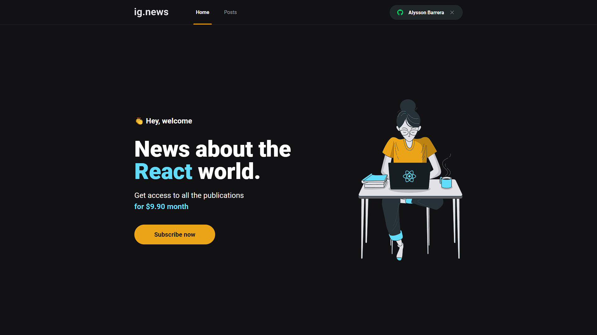

# Ignews - Ignite | Rocketseat

## Português

#### Blog de notícias desenvolvido durante a Trilha React do Ignite da Rocketseat

A construção foi feita com base no design disponibilizado através do figma. A aplicação foi desenvolvida em React com Next.js e Sass, ela faz uso da API de pagamentos do Stripe em conjunto com FaunaDB e também usa o PrismicCMS como Headless CMS. Ela também conta com testes unitários em Jest com Testing Library.

## English

#### News blog developed during Rocketseat Ignite's React Trail

The construction was made based on the design made available through the figma. The application was developed in React with Next.js and Sass, it makes use of the Stripe Payments API in conjunction with FaunaDB and also uses PrismicCMS as Headless CMS. It also features unit tests in Jest with Testing Library.

## Screenshots

    

        
        
        
        
    

## Video

https://user-images.githubusercontent.com/86618257/180626844-59f46a43-1b7c-49b4-90be-52902069b60f.mp4

## Stack

    
